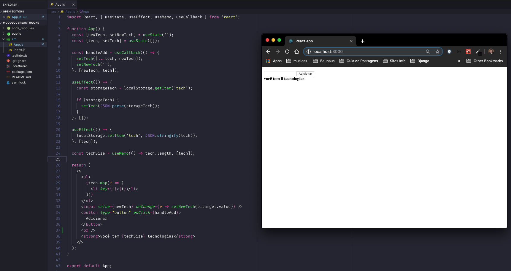
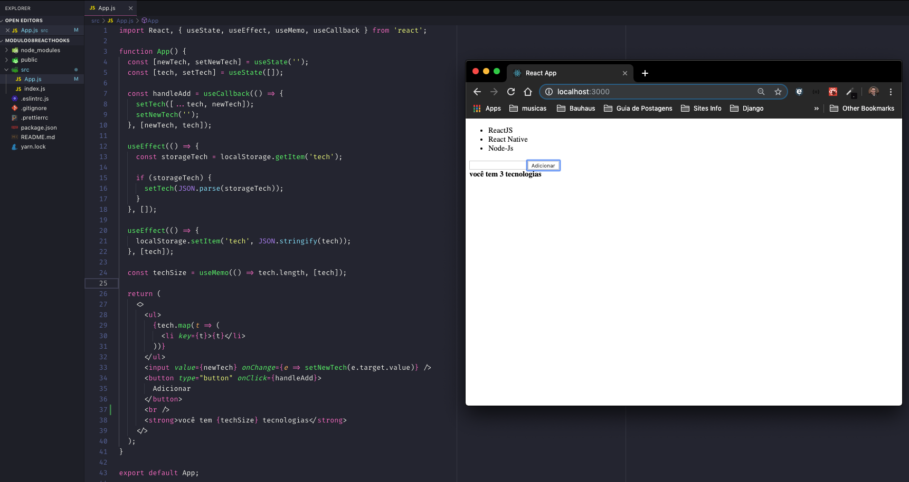

<h1 align="center">Demonstration of React Hooks</h1>

 - This app was developed during the course of RocketSeat using react-native. This app demonstrate the use of react Hooks
 utilizing(useState, useEffect, useMemo, useCallback).

 - This app save the list in localstorage;

## 💻  A simple page

- Linting a list;

<p align="center">

</p>

- Add (ReactJs, React Native and Node.Js) to list;

<p align="center">

</p>


## 🎩 How it works

Install dependêncies
```sh
yarn
```
Run project
```sh
yarn start
```